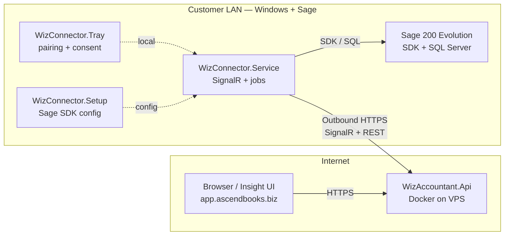

# Manufacturing Module — Agent Handover

**Audience:** A new Cursor agent starting **Sage 200 Evolution manufacturing** work on WizAccountant.  
**Purpose:** Explain how to reach Sage from **outside the customer network**, and how **email (Brevo)** and **SSH** fit into the stack.

**Last updated:** 2026-06-05 (WizAccountant pilot — `app.ascendbooks.biz`)

---

## Table of contents

1. [Architecture at a glance](#1-architecture-at-a-glance)
2. [Connect to Sage from outside the network (Connector + Tray)](#2-connect-to-sage-from-outside-the-network-connector--tray)
3. [Email with Brevo (and what SSH is actually for)](#3-email-with-brevo-and-what-ssh-is-actually-for)
4. [GitHub SSH and cloud deploy](#4-github-ssh-and-cloud-deploy)
5. [Manufacturing module — where to start in code](#5-manufacturing-module--where-to-start-in-code)
6. [Quick reference tables](#6-quick-reference-tables)
7. [Related documents](#7-related-documents)

---

## 1. Architecture at a glance

WizAccountant uses a **split architecture**: the **cloud** hosts the web UI and API; **Sage stays on-premises** on a Windows PC with SQL Server.



### Key design points

| Point | Detail |
|--------|--------|
| **No Sage in the cloud** | Production Docker runs **only** `WizAccountant.Api` + SQLite. Sage DLLs never deploy to the VPS. |
| **Outbound-only connector** | The connector **calls out** to the cloud (`https://app.ascendbooks.biz`). You usually **do not** open inbound firewall ports on the customer network for WizAccountant. |
| **Tray ≠ online status** | **Tray** handles pairing UI and write consent. **Service** maintains SignalR + heartbeats. Admin shows **Offline** if Service is not connected — even when Tray is running. |
| **Pairing code location must match API URL** | Codes created in **production Admin** only work when Tray/Service use **`https://app.ascendbooks.biz`**, not `localhost:5278`. |
| **Writes are gated** | Live Sage posts require `Connector:WritesEnabled=true` **and** tray **Allow cloud posts (1 hour)**. |

### Production URLs (pilot)

| Resource | URL |
|----------|-----|
| Health | https://app.ascendbooks.biz/health |
| Admin (pairing codes, sites) | https://app.ascendbooks.biz/admin/ |
| Insight (chat, dashboards) | https://app.ascendbooks.biz/insight/ |
| Sales Order (example module UI) | https://app.ascendbooks.biz/insight/sales-order/ |
| Act (approvals) | https://app.ascendbooks.biz/act/ |
| VPS | `167.86.125.230` — **not** the WizCRM/WizFlow VPS (`161.97.141.220`) |

Pilot login (change before go-live): `admin@pilot.local` / `pilot`

---

## 2. Connect to Sage from outside the network (Connector + Tray)

### 2.1 Components on the Sage PC

| Component | Path (typical) | Role |
|-----------|----------------|------|
| **WizPilot** | `src\WizAccountant.Manager\bin\Release\net8.0-windows\WizPilot.exe` | Launcher: URLs, start service/tray, open Admin/Insight |
| **WizConnector.Setup** | `src\WizConnector.Setup\bin\Release\net8.0-windows\WizConnector.Setup.exe` | Sage SQL + SDK licence + agent login (encrypted config) |
| **WizConnector.Service** | `src\WizConnector.Service\bin\Release\net8.0\WizConnector.Service.exe` | Worker: hub connection, heartbeats, runs Sage jobs |
| **WizConnector.Tray** | `src\WizConnector.Tray\bin\Release\net8.0-windows\WizConnector.Tray.exe` | System tray: pair, status, write consent, open Setup |

Rebuild after code changes:

```powershell
cd C:\Users\pj\WizAccountant
.\scripts\build-wiz-pilot.ps1
# or: dotnet build WizAccountant.slnx -c Release
```

### 2.2 One-time: Sage SDK on the Windows PC

Follow **`DOCS/SAGE-Connection-Process.md`** in full. Summary:

1. Install **Sage 200 Evolution** + SQL Server company/common databases.
2. Install matching **Pastel.Evolution SDK** (v11.x with Evolution 11) under  
   `C:\Program Files (x86)\Sage Evolution`
3. Run **Administrator** PowerShell:

   ```powershell
   cd C:\Users\pj\WizAccountant\scripts
   .\register-sage-sdk.ps1
   ```

   Uses **32-bit** `regasm` — projects must target **x86**.

4. Open **WizConnector.Setup** → set common + company connection strings, SDK licence serial/key, agent user → **Test Sage connection** must say **Sage OK** → **Save**.

Encrypted config is stored under:

```
C:\ProgramData\WizConnector\
  sage.config          (encrypted Sage settings)
  connector-state.json (site id after pairing)
  tray-settings.json   (tray API URL — per-user AppData, see below)
  write-consent.json   (hourly write consent from tray)
```

Tray settings file (pairing uses this URL):

```
%AppData%\WizConnector\tray-settings.json
```

Example:

```json
{
  "ApiBaseUrl": "https://app.ascendbooks.biz"
}
```

### 2.3 One-time: Cloud API (already deployed for pilot)

See **`DOCS/DEPLOY-ASCENDBOOKS.md`**. Server app root: `/opt/wizaccountant`.  
DNS: **app.ascendbooks.biz** → `167.86.125.230`.

The cloud API exposes:

- REST: `/api/sites`, `/api/jobs/run-wait`, `/api/pairing-codes`, …
- SignalR hub: `/hubs/connector` (connector registers site + heartbeat)

### 2.4 Production pairing workflow (remote Sage access)

Use this when developers or users open **https://app.ascendbooks.biz** from anywhere, while Sage runs on a PC at the customer site.

#### Step A — WizPilot URLs (both must be cloud for remote access)

| WizPilot field | Value |
|----------------|--------|
| **Connector API URL** | `https://app.ascendbooks.biz` |
| **Production web URL** | `https://app.ascendbooks.biz` |

Click **Save URLs**.

> **Common mistake:** Production web URL = cloud, but Connector API URL still `http://localhost:5278`. Pairing then fails because the code was created on production but the tray posts to localhost.

#### Step B — Start connector (do **not** start local API for this mode)

1. Close all old **WizConnector.Service** PowerShell windows and **Exit** tray.
2. WizPilot → **Start service + tray** (once).
3. Confirm **WizConnector.Service** window shows:  
   `Connected to hub for SiteId=...`

If Service started **before** pairing and logged *"Connector is not paired"*, restart Service after pairing.

#### Step C — Tray API URL (must match cloud)

Right-click tray → **Status…** → **API URL** = `https://app.ascendbooks.biz` → **Save URL** → **Refresh**.

#### Step D — Create pairing code (production Admin)

1. WizPilot → **Open in browser — production** → **Admin**  
   Or: https://app.ascendbooks.biz/admin/
2. **Create pairing code** → site name (e.g. `PJ` or `Factory-01`) → **Generate code** (e.g. `WZ511729`).
3. Codes are **one-time** and expire — generate a fresh code if pairing failed.

#### Step E — Pair from tray

Tray → **Pair with code…** → paste code → **Pair**.

#### Step F — Verify online

Admin → **Refresh sites** → status **Online**, **Last seen** populated.

Insight site dropdown shows the site (not “No online sites”).

#### Step G — Enable Sage writes (for posting documents)

Edit connector service settings (Release build):

```
C:\Users\pj\WizAccountant\src\WizConnector.Service\bin\Release\net8.0\appsettings.json
```

```json
"Connector": {
  "ApiBaseUrl": "https://app.ascendbooks.biz",
  "WritesEnabled": true,
  "WriteConsentRequired": true
}
```

Or set environment variables when starting Service:

```powershell
$env:Connector__ApiBaseUrl = 'https://app.ascendbooks.biz'
$env:Connector__WritesEnabled = 'true'
& '...\WizConnector.Service.exe'
```

Then tray → **Allow cloud posts (1 hour)** before each write test session.

**Restart Service** after changing `WritesEnabled`.

Without this, save/post operations return:

> *Writes are disabled. Set Connector:WritesEnabled=true after pilot approval.*

### 2.5 How a remote Insight query reaches Sage

```text
1. Browser (anywhere) → POST /api/jobs/run-wait
   { siteId, operation: "customer.list", parameters: {...} }

2. WizAccountant.Api → SignalR RunJob → WizConnector.Service (on Sage PC)

3. Service → SageSdkJobExecutor / SageSdkPhase2Handlers
   → Pastel.Evolution SDK or controlled SQL

4. Result JSON → POST /api/jobs/{id}/result → back to browser
```

If SignalR is down, Service falls back to **REST long-poll**:  
`GET /api/connector/jobs/next?siteId=...` (when `RestJobPollEnabled=true`, default).

### 2.6 Local-only development (same PC as Sage)

Use **`DOCS/LOCAL-PILOT-START.md`** when **not** testing through the cloud:

| Field | Value |
|--------|--------|
| Connector API URL | `http://localhost:5278` |
| Start local API | Yes (WizPilot → Restart local API) |
| Pairing | Local Admin → http://localhost:5278/admin/ |

Switch to production URLs only after local flows work.

### 2.7 Troubleshooting (remote connection)

| Symptom | Likely cause | Fix |
|---------|--------------|-----|
| Pairing failed — check API URL | Tray still on `localhost:5278` | Set tray + WizPilot Connector URL to cloud; restart tray |
| Site paired but **Offline**, Last seen `—` | Service not running or wrong API URL | Restart **service + tray** with cloud URL; check Service log for hub connect |
| Pairing works then Service exits | Service started before pair | Restart Service after successful pair |
| Insight: No online sites | Site offline or wrong site selected | Admin refresh; pick site in left sidebar |
| Save: Writes disabled | `WritesEnabled=false` | Set `WritesEnabled=true`, tray consent, restart Service |
| Order number `(failed)` | `salesorder.nextnumber` SQL/SDK error | Check Service log; rebuild connector; see `SalesOrderNumberHandler.cs` |
| Tray crash changing API URL | Old HttpClient bug | Rebuild tray (`ApiClient.cs` fix); or edit `tray-settings.json` and restart tray |
| WizPilot “already running” after URL change | Service not restarted | Kill `WizConnector.Service` process, start again |

### 2.8 Security notes for remote access

- Connector uses **pairing codes** (short-lived, one-use) — not shared passwords in the UI.
- Sage SQL credentials and SDK licence live **only** on the Sage PC (`C:\ProgramData\WizConnector\`).
- Cloud API never receives raw SQL connection strings from the browser — only **allowlisted operation names** + parameters.
- For **writes**, use Act approval flow in production; pilot may enable direct writes with `WritesEnabled` + consent.
- **`DOCS/WizVPN.md`** describes a **future** VPN product for direct DB access — **not** required for the current Connector architecture.

---

## 3. Email with Brevo (and what SSH is actually for)

### 3.1 Important clarification: Brevo ≠ SSH

| Technology | Used for |
|------------|----------|
| **Brevo** (SMTP / HTTP API) | Sending transactional email (invites, alerts, approvals) |
| **SSH** | Git push to GitHub, **VPS deploy**, copying secret files to server — **not** sending email |

Do not configure Brevo through SSH. Brevo uses **API keys** and **SMTP credentials** loaded from a **secrets file** at runtime.

### 3.2 Current state in WizAccountant

Email is **not fully implemented** yet. The API has a **stub**:

| Item | Location |
|------|----------|
| Stub endpoint | `POST /api/insight/notifications/stub` |
| Stub service | `src/WizAccountant.Api/Insight/NotificationStubService.cs` |
| Behaviour | Writes to SQLite `NotificationLogs` + logs — **does not send email** |
| Response message | *"Notification logged (email stub — configure Brevo in production)."* |

Planned use cases (from `DOCS/Plan1-Phased-Features.md`): invites, site offline alerts, Act approval notifications.

### 3.3 Brevo account setup (one-time, human / manager)

1. Create or use account at [https://app.brevo.com](https://app.brevo.com).
2. **Senders & IP** → verify domain (e.g. `ascendbooks.biz`) and **From** address (e.g. `noreply@ascendbooks.biz`).
3. **Transactional** → **SMTP & API**:
   - **API key** (`xkeysib-…`) — preferred for HTTP API from .NET
   - **SMTP login** + **SMTP key** (`xsmtpsib-…`) — **not** your Brevo account password

### 3.4 Secrets file pattern (recommended — same as WizFlow)

**Never commit real keys.** Use gitignored files under `config/secrets/`.

#### Step 1 — Add template (committed)

Create `config/secrets/brevo.local.example.txt`:

```ini
# Copy to brevo.local.txt (gitignored). Do not commit brevo.local.txt.

# HTTP API (preferred)
BREVO_API_KEY=xkeysib-your-key-here

# SMTP fallback (optional)
SMTP_HOST=smtp-relay.brevo.com
SMTP_PORT=587
SMTP_USER=your-smtp-login@example.com
SMTP_PASS=xsmtpsib-your-smtp-key-here

# Sender (must be verified in Brevo)
MAIL_FROM=noreply@ascendbooks.biz
MAIL_FROM_NAME=WizAccountant

# Links in email bodies
APP_URL=https://app.ascendbooks.biz
```

#### Step 2 — Create real file (local + server)

```powershell
Copy-Item config\secrets\brevo.local.example.txt config\secrets\brevo.local.txt
# Edit brevo.local.txt with real keys — never paste keys into chat or commits
```

Ensure `.gitignore` includes:

```gitignore
config/secrets/*.credentials.txt
config/secrets/brevo.local.txt
config/secrets/*.txt
!config/secrets/*.example.txt
```

(WizAccountant already gitignores `config/secrets/*.credentials.txt`; add `brevo.local.txt` when implementing.)

#### Step 3 — Load in WizAccountant.Api (implementation task for manufacturing agent)

Suggested approach for .NET (mirror WizFlow’s Python loader from `New-Agent-Training.md`):

1. Add `BrevoOptions` / `EmailService` in `src/WizAccountant.Api`.
2. On startup, read `config/secrets/brevo.local.txt` (or env vars) into `IConfiguration`.
3. Replace `NotificationStubService` with real send via:
   - **Brevo REST API** (`POST https://api.brevo.com/v3/smtp/email`) using `BREVO_API_KEY`, or
   - **`System.Net.Mail.SmtpClient`** / MailKit to `smtp-relay.brevo.com:587`
4. Keep audit log in `NotificationLogs` on success/failure.

Example env vars (alternative to file):

```bash
Brevo__ApiKey=xkeysib-...
Brevo__MailFrom=noreply@ascendbooks.biz
Brevo__AppUrl=https://app.ascendbooks.biz
```

#### Step 4 — Docker / VPS

Current production compose (`infra/docker/docker-compose.prod.yml`) mounts only SQLite volume. When adding Brevo:

```yaml
services:
  api:
    volumes:
      - wizaccountant-data:/data
      - ../../config:/config:ro   # read-only secrets mount
    environment:
      Brevo__SecretsFile: /config/secrets/brevo.local.txt
```

On server **`167.86.125.230`**:

```bash
mkdir -p /opt/wizaccountant/config/secrets
chmod 700 /opt/wizaccountant/config/secrets
# Copy brevo.local.txt securely (scp / manual — not in git)
chmod 600 /opt/wizaccountant/config/secrets/brevo.local.txt
```

Then redeploy: `bash /opt/wizaccountant/scripts/deploy-vps-wizaccountant.sh`

#### Step 5 — Test (after implementation)

```powershell
# Example once a test endpoint or script exists:
curl -X POST https://app.ascendbooks.biz/api/insight/notifications/test `
  -H "Content-Type: application/json" `
  -d '{"email":"you@example.com"}'
```

WizFlow reference tests (Python — adapt for .NET):

```powershell
# WizFlow only — pattern reference
docker compose -p wizflow exec -T api python -m scripts.validate_brevo_config
docker compose -p wizflow exec -T api python -m scripts.test_brevo_smtp
```

### 3.5 Brevo troubleshooting

| Issue | Check |
|-------|--------|
| 401 / authentication failed | API key is `xkeysib-…`, not account password |
| Sender rejected | `MAIL_FROM` verified in Brevo domain settings |
| Emails in spam | SPF/DKIM/DMARC on sending domain |
| Works locally, fails on VPS | `brevo.local.txt` present on server, mounted in Docker |
| Keys in git history | Rotate keys in Brevo; never commit secrets |

---

## 4. GitHub SSH and cloud deploy

These use **SSH** — separate from Brevo.

### 4.1 GitHub (push code from dev PC)

| Item | WizAccountant value |
|------|---------------------|
| Remote | `git@github.com-pj-nrb-ke:pj-nrb-ke/WizAccountant.git` |
| SSH host alias | `github.com-pj-nrb-ke` |
| Key | `%USERPROFILE%\.ssh\github_pj_nrb_ke` |
| Setup script | `scripts/setup-github-ssh.ps1` |

Verify:

```powershell
ssh -T git@github.com-pj-nrb-ke
cd C:\Users\pj\WizAccountant
git push origin main
```

Full pattern: **`New-Agent-Training.md`** §2 (same GitHub account as WizFlow/WizCRM).

### 4.2 Deploy API to production (SSH to VPS)

**Never SCP application folders.** Server always pulls from GitHub.

```powershell
cd C:\Users\pj\WizAccountant
git push origin main

ssh -i $env:USERPROFILE\.ssh\contabo_wizerp root@167.86.125.230 `
  "cd /opt/wizaccountant && git fetch origin && git checkout main && git reset --hard origin/main && bash scripts/deploy-vps-wizaccountant.sh"
```

Or use `scripts/deploy-ascendbooks.ps1` (requires `config/secrets/ascendbooks-server.credentials.txt` from example).

| Item | Value |
|------|--------|
| VPS IP | `167.86.125.230` |
| SSH key | `%USERPROFILE%\.ssh\contabo_wizerp` |
| App path | `/opt/wizaccountant` |
| Docker project | `wizaccountant` |
| Internal API port | `127.0.0.1:8088` → Caddy → `https://app.ascendbooks.biz` |

Verify: https://app.ascendbooks.biz/health → `{"ok":true,...}`

**Note:** Deploy updates **cloud API + static wwwroot** only. After deploy, users must **hard-refresh** (`Ctrl+F5`) Insight pages. **WizConnector on the Sage PC must be rebuilt/restarted separately** for connector handler changes.

---

## 5. Manufacturing module — where to start in code

### 5.1 Read first (mandatory)

| Doc | Why |
|-----|-----|
| `AGENTS.md` | Intent-first rules, SQL vs SDK |
| `DOCS/SAGE-AI-AGENT-TRAINING-INDEX.md` | Training pack index |
| `DOCS/Sage_200_Evolution_Database_Handover.md` | Tables, BOM, manufacturing context |
| `DOCS/SAGE-200-DATABASE-LAYERS.md` | Which layer owns which data |
| `DOCS/SDK/C Sales Orders - … .pdf` | SDK posting pattern (quotes/orders) |
| `DOCS/SAGE-Connection-Process.md` | SDK registration and Setup |

### 5.2 Adding a new Sage read/write operation

Typical pipeline:

```text
Insight UI / chat
  → InsightReadOnlyTools.cs (allowlist)
  → POST /api/jobs/run-wait
  → WizConnector.Service
      SageSdkJobExecutor.cs (read routing)
      SageSdkPhase2Handlers.cs (reads)
      SageSdkWriteHandlers.cs (writes — allowlist)
  → Pastel.Evolution SDK or SQL handler in Sage/
```

Registration checklist:

1. Implement handler in `src/WizConnector.Service/Sage/YourHandler.cs`
2. Register read op in `SageSdkPhase2Handlers.cs` or write in `SageSdkWriteHandlers.cs`
3. Add to `ConnectorModels.cs` job executor routing if needed
4. Add to `ConnectorWriteAllowlist.cs` for writes
5. Add to `InsightReadOnlyTools.cs` on API
6. Add intent tests: `tests/WizAccountant.Insight.Intents.Tests/`
7. Document in `DOCS/INSIGHT-CHAT-INTENTS.md`

### 5.3 SQL vs SDK (manufacturing)

| Use SDK | Use SQL (connector handler) |
|---------|------------------------------|
| Posting BOM issues, production orders, stock transactions | Analytics, counts, listings, reconciliation |
| Document save with business rules | Complex joins across Sage tables |

Never expose raw SQL from the browser — only **named operations**.

### 5.4 Regression tests

```powershell
dotnet test tests/WizAccountant.Insight.Intents.Tests
dotnet build WizAccountant.slnx -c Release
```

### 5.5 Local vs production testing matrix

| Test type | Connector API URL | API running |
|-----------|-------------------|-------------|
| Local dev | `http://localhost:5278` | Local WizAccountant.Api |
| Remote / manufacturing UAT | `https://app.ascendbooks.biz` | Cloud only — Service on Sage PC |

---

## 6. Quick reference tables

### Config files

| File | Purpose |
|------|---------|
| `%ProgramData%\WizConnector\sage.config` | Encrypted Sage SQL + licence |
| `%ProgramData%\WizConnector\connector-state.json` | Paired site id |
| `%AppData%\WizConnector\tray-settings.json` | Tray API URL |
| `%ProgramData%\WizConnector\write-consent.json` | Hourly write consent |
| `src\WizConnector.Service\bin\Release\net8.0\appsettings.json` | Connector flags (`WritesEnabled`, etc.) |
| `config/secrets/ascendbooks-server.credentials.txt` | VPS SSH deploy (gitignored) |
| `config/secrets/brevo.local.txt` | Brevo keys (**to be added**, gitignored) |

### WizPilot — production remote Sage

| Setting | Value |
|---------|--------|
| Connector API URL | `https://app.ascendbooks.biz` |
| Production web URL | `https://app.ascendbooks.biz` |
| Start local API | **No** |
| Start service + tray | **Yes** |

### Enable posting to Sage

| Step | Action |
|------|--------|
| 1 | `Connector:WritesEnabled=true` in service config |
| 2 | Tray → **Allow cloud posts (1 hour)** |
| 3 | Restart WizConnector.Service |

---

## 7. Related documents

| Document | Topic |
|----------|--------|
| `DOCS/LOCAL-PILOT-START.md` | Local-only WizPilot workflow |
| `DOCS/DEPLOY-ASCENDBOOKS.md` | Cloud deploy |
| `DOCS/SAGE-Connection-Process.md` | Sage SDK + regasm |
| `DOCS/PHASE3-APPROVALS.md` | Act approvals + writes |
| `DOCS/WizVPN.md` | Future VPN design (not current connector path) |
| `New-Agent-Training.md` | WizFlow patterns: Git SSH, Brevo file layout, VPS |
| `DOCS/SDK/` | Sage Order Entry SDK PDF guides |

---

*For manufacturing-specific business rules, extend this doc with BOM/routing table maps once handlers are scoped.*
