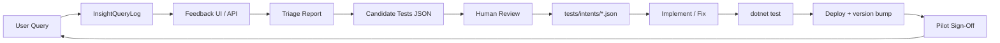

# Pilot Stabilization Workflow (SOP)

Standard operating procedure for the **Pilot Stabilization Phase** — measured refinement, not mass handler expansion.

## Philosophy

```text
real usage → telemetry → triage → candidate tests → human review → fix → regression → deploy → sign-off
```

NOT: random handlers, giant synthetic packs, uncontrolled semantic growth.

---

## Standard workflow



### Step-by-step

| Step | Owner | Artifact / command |
|------|-------|-------------------|
| 1. User asks in Insight | Pilot user | Live query |
| 2. Logged automatically | System | `InsightQueryLogs` + `QueryLogId` on response |
| 3. Feedback captured | Pilot user | UI buttons or `POST /api/insight/feedback` |
| 4. Triage | Dev / ops | `.\scripts\weekly-pilot-review.ps1` |
| 5. Candidate tests | System | `tests/intents/candidates/candidate-tests-*.json` |
| 6. Human review | Dev | Approve 3–10 cases; add to Real Query Bank |
| 7. Promote tests | Dev | Move approved JSON into `tests/intents/` |
| 8. Implement / fix | Dev | Handler + route + validator only if gap registered |
| 9. Full regression | CI / local | `dotnet test tests/WizAccountant.Insight.Intents.Tests` |
| 10. Deploy | Ops | Version bump `InsightChatInfo` + deploy script |
| 11. Sign-off | Business reviewer | Update `DOCS/Pilot_Query_Signoff.md` |

---

## Operating rules

### Real query first

```text
Real failed query > synthetic training example
```

Add exact wording to `DOCS/Real_Insight_Queries.md` before implementing.

### One canonical meaning

If `prompt payer` → `customer.payment.prompt.top`, strengthen that route. Do not add `customer.fastpayer.top` without consolidation.

### No random handler growth

New handlers require:

- Repeated triage evidence OR 2+ wrong feedbacks  
- Real Query Bank entry  
- Capability Gap Register item  
- Human PR approval  

### Output validation

Every promoted analytical query defines **Expected Output Shape**. Use `OutputContractValidator` where JSON structure matters.

### Production safety

Do not mark **Production Ready** unless:

- Route stable  
- Output validated  
- No runtime crash  
- Schema confirmed on pilot Sage DB  
- Business meaning validated  
- Regression test exists  

---

## Weekly rhythm

Run every week during pilot:

```powershell
.\scripts\weekly-pilot-review.ps1
```

Then:

1. Review triage markdown — top unmatched + failures + wrong feedback  
2. Classify each item using `DOCS/Query_Triage_Priority.md`  
3. Update `DOCS/Capability_Gap_Register.md` for new gaps  
4. Promote top 5–10 candidate tests (human approval)  
5. Fix **only** highest-impact gaps (Critical + High)  
6. Run full regression  
7. Update sign-off tracker  
8. Deploy controlled build with version bump  

---

## Related documents

| Document | Purpose |
|----------|---------|
| `Real_Insight_Queries.md` | Permanent query bank |
| `Pilot_Query_Signoff.md` | UAT / production readiness |
| `Query_Triage_Priority.md` | Priority matrix + buckets |
| `Capability_Gap_Register.md` | Unsupported capabilities |
| `Sage_AI_Self_Training_Roadmap.md` | Architecture layers A–E |
| `Sage_AI_Knowledge_Input_Checklist.md` | What humans should supply |

---

## API / UI touchpoints

| Endpoint / UI | Role |
|---------------|------|
| `POST /api/insight/chat` | Returns `queryLogId` |
| `POST /api/insight/feedback` | `helpful` / `wrong` / `needs_improvement` + reason |
| `GET /api/insight/triage?days=7` | Weekly report + candidate JSON |
| Insight feedback bar | Correct / Wrong / Needs improvement |

No API changes required for this OPS layer — discipline is documentation + weekly script.
